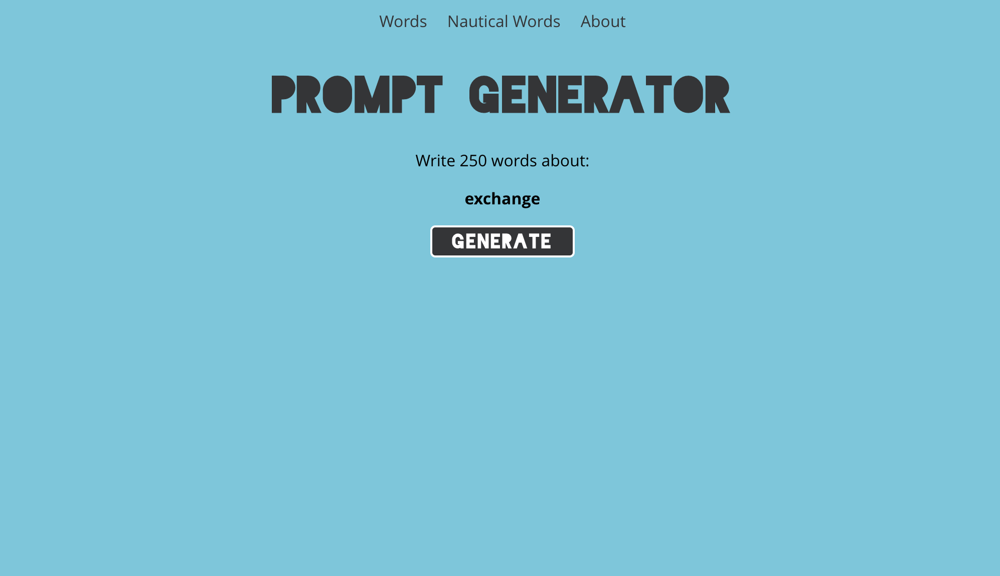

# Prompt Generator

Stuck on what to write? Try this simple writing prompt generator!

Prompt Generator is a single page React app where users can generate writing prompts from multiple lists of words (currently a general set of random words from [__] or nautical terms).

Check it out here: https://promptgenerator.netlify.app/

## Installation

1. Fork the repository
2. Clone the files to your computer
3. Navigate to `/novel-tracker-frontend` in your terminal
4. Run `npm install`
5. Run `npm start`. This will open the app in your browser of choice!

## Usage Example

## Contributing
Pull requests are welcome. For major changes, please open an issue first to discuss what you would like to change.

## License
[MIT](https://choosealicense.com/licenses/mit/)
